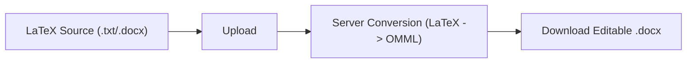

# LaTeX Word Equation Converter

[](https://github.com/jmaelectro/latex-word-equation-converter/actions/workflows/ci.yml)
[](./LICENSE)
[](https://github.com/jmaelectro/latex-word-equation-converter/tags)

Convert `.txt` / `.docx` files containing LaTeX into `.docx` files with native editable Word equations (OMML).

Demo: [https://www.ecuacionesaword.com](https://www.ecuacionesaword.com)

---

## English

### What it does
1. Prepare text with LaTeX formulas (ChatGPT, Gemini, Copilot, Overleaf, Obsidian, etc.).
2. Upload `.txt` or `.docx`.
3. Convert formulas to native Word OMML equations.
4. Download editable `.docx`.

### Why it is useful
- Avoid screenshots or broken math in submissions.
- Keep equations editable inside Microsoft Word.
- Save time in thesis/homework/report workflows.

### Visual flow


### Typical use cases
- AI-generated math to Word.
- Overleaf/Markdown to Word.
- Thesis and assignment formatting.
- Team collaboration on `.docx` files.

### Limitations
- Complex custom LaTeX macros may need manual cleanup.
- Corrupted source documents can fail conversion.
- Very large files may be rejected by size limits.
- This is a practical converter, not a full LaTeX compiler.

### Local setup
```bash
python -m venv .venv
.venv\Scripts\activate
python -m pip install -r requirements.txt
uvicorn main:app --reload
```

Open [http://127.0.0.1:8000](http://127.0.0.1:8000)

### Deployment
- `render.yaml` is included for Render.
- Recommended production env vars:
  - `CANONICAL_HOST`
  - `CANONICAL_SCHEME`
  - `CANONICAL_SITE_ORIGIN`
  - `ALLOWED_ORIGINS`

### Trust and process docs
- [Contributing](./CONTRIBUTING.md)
- [Security policy](./SECURITY.md)
- [Code of Conduct](./CODE_OF_CONDUCT.md)
- [Changelog](./CHANGELOG.md)

### Live site sources
- Home pages live in `index.html` and `index-en.html`.
- Dynamic pages live in `templates/`, with blog metadata/content in `blog_content/`.
- Historical root HTML copies are intentionally removed from the live flow; old URLs are preserved via redirects in `main.py`.

---

## Español

### Qué hace
1. Preparas texto con fórmulas LaTeX (ChatGPT, Gemini, Copilot, Overleaf, Obsidian, etc.).
2. Subes `.txt` o `.docx`.
3. Convierte fórmulas a ecuaciones nativas OMML de Word.
4. Descargas `.docx` editable.

### Por qué sirve
- Evita capturas o fórmulas rotas al entregar trabajos.
- Mantiene ecuaciones editables en Word.
- Ahorra tiempo en TFG/TFM, informes y ejercicios.

### Casos de uso
- Pasar resultados matemáticos de IA a Word.
- Llevar contenido de Overleaf/Markdown a Word.
- Preparar entregas académicas con formato limpio.
- Colaborar en `.docx` con ecuaciones editables.

### Limitaciones
- Macros LaTeX complejas pueden requerir retoque manual.
- Documentos de entrada corruptos pueden fallar.
- Archivos grandes pueden superar límites de tamaño.
- No reemplaza un compilador LaTeX completo.

### Ejecución local
```bash
python -m venv .venv
.venv\Scripts\activate
python -m pip install -r requirements.txt
uvicorn main:app --reload
```

Abre [http://127.0.0.1:8000](http://127.0.0.1:8000)

### Documentación del proyecto
- [Contribuir](./CONTRIBUTING.md)
- [Política de seguridad](./SECURITY.md)
- [Código de conducta](./CODE_OF_CONDUCT.md)
- [Historial de cambios](./CHANGELOG.md)

### SEO / contenido
- Blog ES: [https://www.ecuacionesaword.com/blog](https://www.ecuacionesaword.com/blog)
- Blog EN: [https://www.ecuacionesaword.com/en/blog](https://www.ecuacionesaword.com/en/blog)

---

## Tech stack
- FastAPI
- python-docx
- math2docx
- Jinja2

## License
MIT
